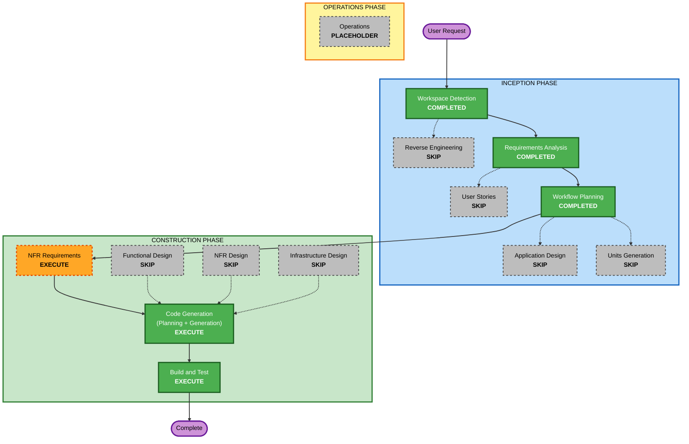

# Execution Plan

## Detailed Analysis Summary

### Change Impact Assessment

- **User-facing changes**: Yes - a new HTTP API route is exposed.
- **Structural changes**: Yes - a new Node.js Express project structure will be created.
- **Data model changes**: No - there is no database or persistent domain model.
- **API changes**: Yes - new `GET /hello` and extension-required `GET /hello/health` endpoints.
- **NFR impact**: Yes - Health Check rules and partial Property-Based Testing rules apply.

### Risk Assessment

- **Risk Level**: Low
- **Rollback Complexity**: Easy
- **Testing Complexity**: Simple

## Workflow Visualization

### Text Alternative

INCEPTION:
- Workspace Detection: completed
- Reverse Engineering: skipped because the workspace is greenfield
- Requirements Analysis: completed
- User Stories: skipped because this is a simple technical API project with no distinct user workflows
- Workflow Planning: completed
- Application Design: skipped because the implementation fits within a single small Express service
- Units Generation: skipped because there is one unit of work

CONSTRUCTION:
- Functional Design: skipped because there is no complex business logic or data model
- NFR Requirements: execute because Health Check and partial PBT rules require construction-level decisions
- NFR Design: skipped because no separate NFR architecture patterns are needed
- Infrastructure Design: skipped because deployment infrastructure is out of scope
- Code Generation: execute
- Build and Test: execute

## Phases to Execute

### INCEPTION PHASE

- [x] Workspace Detection (COMPLETED)
- [x] Reverse Engineering (SKIPPED)
- [x] Requirements Analysis (COMPLETED)
- [x] User Stories (SKIPPED)
- [x] Workflow Planning (COMPLETED)
- [x] Application Design - SKIP
  - **Rationale**: Single small Express service with straightforward routes.
- [x] Units Generation - SKIP
  - **Rationale**: One unit of work is sufficient.

### CONSTRUCTION PHASE

- [x] Functional Design - SKIP
  - **Rationale**: No complex business logic, state model, or schema design.
- [ ] NFR Requirements - EXECUTE
  - **Rationale**: Health Check and partial PBT rules require explicit testing and framework decisions.
- [x] NFR Design - SKIP
  - **Rationale**: No separate NFR design patterns are needed for this service.
- [x] Infrastructure Design - SKIP
  - **Rationale**: Deployment infrastructure is out of scope.
- [ ] Code Generation - EXECUTE
  - **Rationale**: Implementation planning and code generation are needed.
- [ ] Build and Test - EXECUTE
  - **Rationale**: Build, test, and verification are needed.

### OPERATIONS PHASE

- [ ] Operations - PLACEHOLDER
  - **Rationale**: Future deployment and monitoring workflows.

## Estimated Timeline

- **Total stages to execute after planning approval**: 3
- **Stages**: NFR Requirements, Code Generation, Build and Test
- **Estimated duration**: Short

## Success Criteria

- `package.json` defines a pure JavaScript Node.js project with Express as the only runtime dependency.
- The service exposes `GET /hello` with exact JSON response `{ "message": "Hello World!" }`.
- The service exposes `GET /hello/health` with a compliant health response.
- Automated tests cover the hello route and health endpoint.
- Build/test instructions document the commands needed to verify the project.

## Extension Compliance Summary

| Extension Rule | Status | Rationale |
|---|---|---|
| HEALTH-01 | Compliant | Plan includes `GET /hello/health` for the `/hello` route group. |
| HEALTH-02 | Compliant | Health response contract is carried into construction. |
| HEALTH-03 | Compliant | Health endpoint remains lightweight and bounded. |
| HEALTH-04 | Compliant | Build and Test will include health endpoint tests. |
| HEALTH-05 | Compliant | Public non-sensitive liveness exposure is documented. |
| Security Baseline | N/A | Disabled by user opt-out. |
| PBT-02 | N/A | No inverse operation is planned. |
| PBT-03 | N/A at planning stage | Reassess if invariant-bearing helpers are introduced during code generation. |
| PBT-07 | N/A at planning stage | Applies only if PBT tests are added. |
| PBT-08 | N/A at planning stage | Applies only if PBT tests are added. |
| PBT-09 | Compliant | NFR Requirements stage will select and document the PBT framework decision. |
